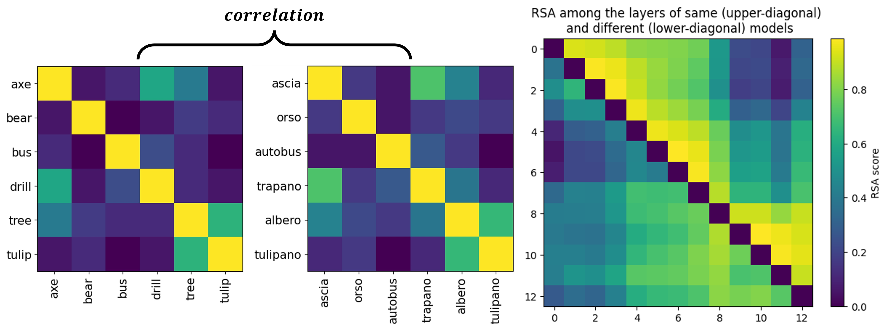

# Large language models for psycholinguistics
### A tutorial notebook

You can find the Colab notebook [here](https://drive.google.com/file/d/1NkIgEsPuNN1uiN4-kM8r-XluBqtBX17V/view?usp=sharing). The present GitHub repo comes with the materials used in the tutorial (images, text)

---

### About
The present notebook is a guide on (mostly) language models. It was developed over the course of two workshops as a learning resource for psychologists, linguists and neuroscientists, and is geared toward that audience (I'm one of them myself 😺). Lacking extensive commentary, I suggest using the notebook as a playground! Code sections also come with example exercises, followed by possible solutions. The main topics covered are:
*  **representations** in LLMs: extracting and comparing word embeddings, probe the effects of context, compare representations within and across models
*  **prediction** in LLMs: extracting predictability measures, use them to probe the 'knowledge' of models
*  **multimodality**: extract representations from a computer vision models, compare them to those of LLMs, and extract prediction measures from language-vision models

---

### **Acknowledgements**

The notebook was first developed for [WoProc 2024](https://moproc2024.net/) (2h workshop) and was then greatly expanded for the [MEDAL Summer School in Computational Modelling](https://medal.ut.ee/event/medal-summer-school-in-computational-linguistics/) (6h workshop). I am grateful to the organizers of WoProc and MEDAL for the opportunity to carry out my workshops and thus develop these materials, and to the attendees for their feedback. I am thankful to Marco Marelli, Anastasia Galkina and Lance Gamboa for their comments, to Giovanni Cassani and Fritz Günther for sharing valuable materials. Finally, most of what is covered leverages (and is made possible by) the `minicons` library:
<medium>
> Misra, K. (2022). minicons: Enabling flexible behavioral and representational analyses of transformer language models. arXiv preprint arXiv:2203.13112.
</medium>

---

### Examples from the notebook
Extract word embeddings from BERT and inspect how context can modulate their representation. For example, what happens to <u>fruitless<u> when we place it in a sentence that points to its typical methaporical meaning ("vain") as opposed to one where its meaning is literal ("without fruits")? 

Observe the effect of replacing a word with sense-appropriate and sense-inappropriate alternatives using the [WiC annotated dataset](https://osf.io/preprints/psyarxiv/b45ys_v1). Look both at embeddings and surprisal:

Perform representational similarity analysis to compare how the same concepts are represented across languages:

Compare concept representations across modalities in unimodal models, using the AlexNet convolutional neural network to represent images (from the [THINGSplus database](https://link.springer.com/article/10.3758/s13428-023-02110-8)) and BERT-large to represent captions:

